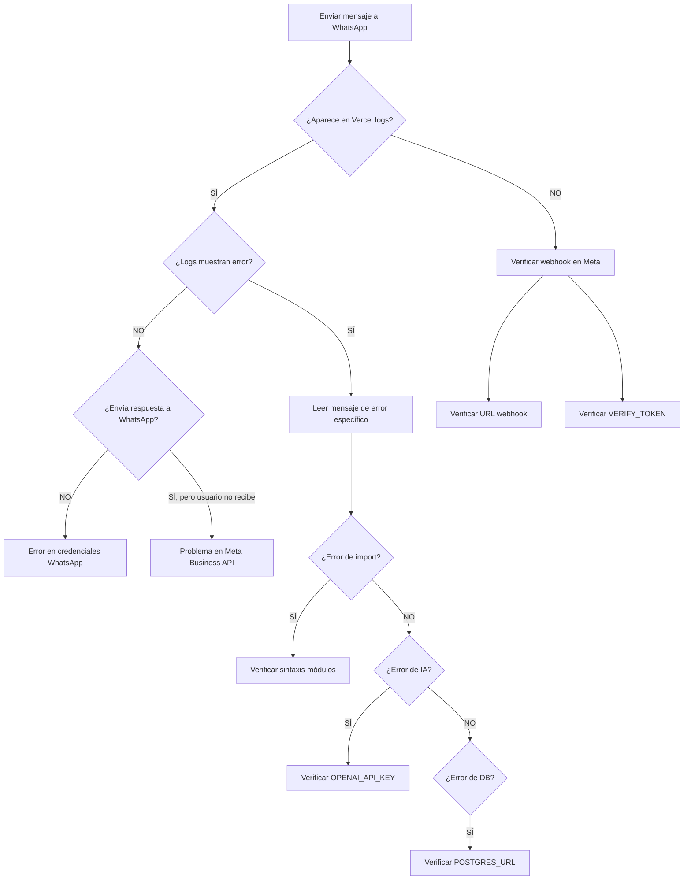

# 🔧 Diagnóstico: Bot de WhatsApp No Responde

## 📋 Checklist de Diagnóstico

### 1️⃣ Variables de Entorno en Vercel

Verificar que TODAS estas variables estén configuradas en Vercel:

```bash
# WhatsApp Business API
WHATSAPP_VERIFY_TOKEN=tu_token_de_verificacion
WHATSAPP_ACCESS_TOKEN=tu_token_permanente
WHATSAPP_PHONE_NUMBER_ID=tu_phone_number_id

# OpenAI
OPENAI_API_KEY=sk-...

# Base de Datos (Neon PostgreSQL)
POSTGRES_URL=postgresql://...
NEON_DATABASE_URL=postgresql://...  # Opcional, copia de POSTGRES_URL

# Notificaciones
WHATSAPP_STAFF_GROUP_ID=120363...@g.us  # Opcional
```

**Cómo verificar:**
1. Ir a Vercel Dashboard
2. Proyecto → Settings → Environment Variables
3. Verificar que TODAS estén presentes
4. Hacer redeploy después de agregar variables

---

### 2️⃣ Endpoint de Test Simple

Creamos un endpoint de prueba que NO usa IA ni base de datos:

**URL:** `https://saludbioskin.vercel.app/api/test-chatbot-simple`

#### Pasos para probar:

1. **Cambiar webhook en Meta**:
   - Ir a Meta Developer Console
   - Ir a WhatsApp → Configuration → Webhooks
   - Cambiar URL temporalmente a: `https://saludbioskin.vercel.app/api/test-chatbot-simple`
   - Verificar (debe pasar)

2. **Enviar mensaje de prueba**:
   - Enviar cualquier mensaje al número de WhatsApp Business
   - Debería responder: "🧪 TEST: Bot funcionando correctamente"

3. **Revisar logs**:
   - Ir a Vercel Dashboard → Deployments → Latest → Functions
   - Buscar `/api/test-chatbot-simple`
   - Ver logs detallados

#### Resultados posibles:

- ✅ **Responde "TEST: Bot funcionando"** → Problema está en módulos (IA/DB)
- ❌ **No responde nada** → Problema en credenciales de WhatsApp
- ❌ **No aparece en logs** → Webhook no está llegando

---

### 3️⃣ Revisar Logs de Vercel

**Cómo ver logs en tiempo real:**

```bash
# Opción 1: CLI de Vercel
vercel logs --follow

# Opción 2: Dashboard
# Vercel → Tu proyecto → Deployments → Latest → Functions
# Click en la función → Ver logs
```

**Qué buscar:**

```
✅ Logs normales:
🔵 Webhook POST recibido
📱 Procesando mensaje de WhatsApp
📨 Mensaje de [número]: "texto"
🤖 Paso 5: Generando respuesta con IA
✅ Respuesta enviada a WhatsApp exitosamente

❌ Errores comunes:
❌ Error en endpoint: [mensaje]
❌ Error CRÍTICO generando respuesta
❌ Error enviando a WhatsApp
```

---

### 4️⃣ Verificar Import del Módulo Corregido

El error "Unexpected identificador 'data'" debería estar resuelto.

**Probar import:**

```bash
# En terminal local
node -e "import('./lib/chatbot-ai-service.js').then(() => console.log('✅ Import OK')).catch(e => console.error('❌', e.message))"
```

---

### 5️⃣ Verificar Conexión a Base de Datos

**Endpoint de prueba:** `https://saludbioskin.vercel.app/api/test-db-connection`

Debería retornar:
```json
{
  "status": "ok",
  "postgres_url_configured": true,
  "connection_test": "success"
}
```

---

### 6️⃣ Workflow de Diagnóstico Completo



---

## 🛠️ Soluciones Rápidas

### Problema: No hay logs en Vercel
**Solución:** 
```bash
# Webhook no está llegando
1. Verificar URL en Meta Developer Console
2. URL correcta: https://saludbioskin.vercel.app/api/whatsapp-chatbot
3. Re-verificar webhook
```

### Problema: Error "OPENAI_API_KEY no configurado"
**Solución:**
```bash
# En Vercel Dashboard
1. Settings → Environment Variables
2. Agregar: OPENAI_API_KEY = sk-...
3. Redeploy
```

### Problema: Error "Credenciales de WhatsApp faltantes"
**Solución:**
```bash
# Verificar en Vercel:
WHATSAPP_PHONE_NUMBER_ID=...
WHATSAPP_ACCESS_TOKEN=...

# Obtener tokens:
# Meta Developer Console → WhatsApp → API Setup
```

### Problema: Bot responde en test pero no en producción
**Solución:**
```bash
# Cambiar de test-chatbot-simple a whatsapp-chatbot
1. Meta Console → Webhooks
2. Cambiar URL a: /api/whatsapp-chatbot
3. Verificar nuevamente
```

---

## 📞 Comandos de Emergencia

### Activar modo fallback (sin IA, respuestas predefinidas)

En `api/whatsapp-chatbot.js` línea 33:

```javascript
const DISABLE_OPENAI = true; // ✅ Cambiar a true
```

Esto hará que el bot responda con mensajes predefinidos sin usar OpenAI.

### Desactivar base de datos (solo memoria)

En `api/whatsapp-chatbot.js` línea 30:

```javascript
let useFallback = true; // ✅ Cambiar a true
```

Esto hará que use almacenamiento en memoria en lugar de Neon PostgreSQL.

---

## 🔍 Logs Ideales (Todo Funcionando)

```
🔵 Webhook POST recibido: {...}
📱 Procesando mensaje de WhatsApp...
📨 Mensaje de 593969890689: "hola"
🔑 Session ID generado: whatsapp_593969890689
💾 Paso 2: Creando/actualizando conversación...
✅ Conversación actualizada
💾 Paso 3: Guardando mensaje del usuario...
✅ Mensaje del usuario guardado
💾 Paso 4: Obteniendo historial...
✅ Historial obtenido: 2 mensajes
📅 Paso 4.5: Verificando estado de agendamiento...
🔧 [StateMachine] Estado actual: IDLE
🤖 Paso 5: Generando respuesta con IA...
🔑 [AI] OPENAI_API_KEY configurado: true
🔍 [AI] Iniciando generación de respuesta...
✅ Respuesta generada: "Buenos días, soy Salomé..." (45 tokens)
💾 Paso 6: Guardando respuesta del asistente...
✅ Respuesta del asistente guardada
📤 Paso 7: Enviando respuesta a WhatsApp...
📤 Intentando enviar mensaje a 593969890689
🚀 Enviando request a WhatsApp API...
📊 Response status: 200 OK
✅ Mensaje enviado a WhatsApp con ID: wamid.xxx
✅ Respuesta enviada a WhatsApp exitosamente
✅ Mensaje procesado exitosamente
```

---

## 🎯 Próximos Pasos

1. Usar endpoint `/api/test-chatbot-simple` para aislar el problema
2. Revisar logs de Vercel en tiempo real
3. Verificar variables de entorno una por una
4. Si todo falla: Activar modo DISABLE_OPENAI para respuestas básicas

